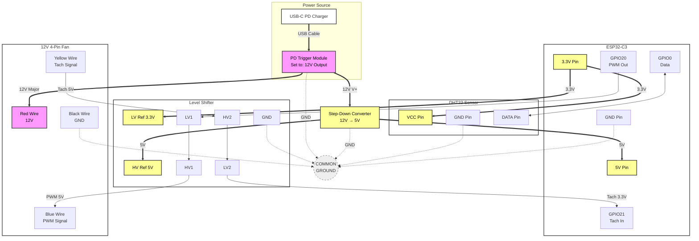

# ESPHome Fan Controller

Temperature-controlled fan for cooling cabinets. Inspired by [Patrick's project](https://github.com/patrickcollins12/esphome-fan-controller).

## Parts
- ESP32-C3-DevKitM-1
- DHT22 temperature sensor
- 12V 4-pin PWM PC fan
- USB-C PD power supply (12V capable)
- USB-C PD trigger module (set to 12V output)
- DC step-down converter (12V → 5V) for ESP32
- Logic level converter (3.3V ↔ 5V) for PWM output and tachometer input
- Some wires

## Wiring

| ESP32-C3 | Level Converter | Fan Wire | Description |
|----------|-----------------|----------|-------------|
| 3.3V     | LV              | -        | Low voltage reference |
| 5V       | HV              | -        | High voltage reference (from step-down) |
| GND      | GND             | Black    | Common ground |
| GPIO20   | LV1 → HV1       | Blue     | PWM speed control |
| GPIO21   | LV2 → HV2       | Yellow   | Tachometer RPM signal |
| GPIO0    | -               | -        | DHT22 data pin |

## How It Works
Set target temperature. Fan adjusts speed automatically.
- Too hot → Fan speeds up
- Just right → Fan slows/stops
- Set to 0°C → Fan runs 100% (manual mode)

## Setup
1. Install ESPHome
2. Edit WiFi credentials in `fan-control.yaml`
3. Flash ESP32
4. Add to Home Assistant

## Tuning
Default values work fine (optimized for quiet). If needed:
- **Response Speed (P)**: How aggressive (0.3 = quiet)
- **Drift Correction (I)**: Fixes offset (0.0015 = stable)

All settings (P, I, and temperature) save to flash and survive reboots.

### Auto-Tune Button
Automatically finds "perfect" PID values by cycling the fan on/off repeatedly for ~30 minutes. Fan will be noisy during tuning and likely noisier after (optimizes for accuracy, not quiet). Only use if default values don't work for you.

That's it.